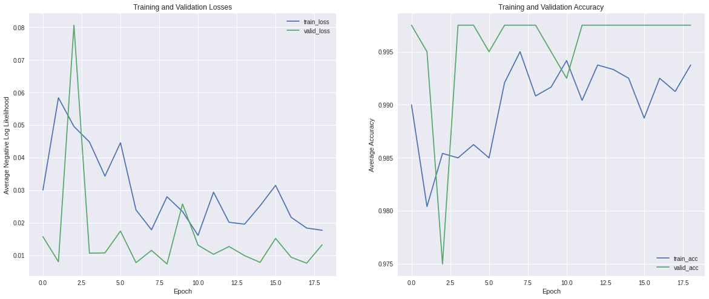
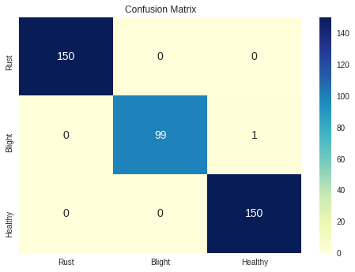
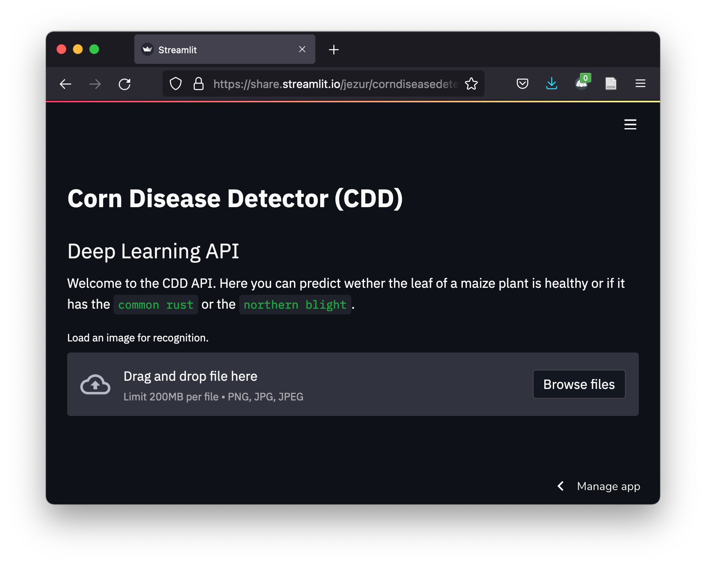

## Welcome to CDD Main Page


**Authors:** Juan Zurita, [Sebastián Ayala Ruano](https://sayalaruano.github.io/), Ximena Celi, Gilberto Rodríguez.   

Infectious diseases are a **major threat** for many crops of high importance for the food security of many regions of the world. Each year, around 60% of farmers in Ecuador have reported **pre-harvest losses** due to infectious agents such as fungi and bacteria, in crops like banana, cacao, and potato. Outbreaks of infection could endanger the country's economy and cause many people to lose their jobs. This project is an effort to develop an **early plant disease detector** as a *proof of concept*, using [publicly available datasets of maize](https://data.mendeley.com/datasets/tywbtsjrjv/1). In the future, we plan to expand this project to cover other important farming Ecuadorian species. 

### Dataset 

The image dataset split in training, validation, and test used to build our model is available at this [link](https://drive.google.com/drive/folders/1xxGh6VnyTCLn9YTyA16t5BrlmdhEKoDG?usp=sharing). 

### About our model

Our model is a classifier based on **convolutional neural networks**, trained to recognize two types of maize infectious diseases: Common rust of corn and Northern corn leaf blight. The available datasets for maize are too small to be used in deep neural networks. To solve this problem we used a `Transfer Learning` strategy and reused some layers from a `ResNet50` neural network trained on the [`ImageNet dataset`](https://www.image-net.org/), from [torchvision.models.resnet50](https://pytorch.org/vision/stable/_modules/torchvision/models/resnet.html). In this way, general image patterns are identified by pre-trained layers, and we trained additional layers of the network to identify healthy and diseased corn images. This network architecture has shown very promising results in [previous studies](https://plantmethods.biomedcentral.com/articles/10.1186/s13007-019-0475-z) of computer vision for agriculture. 

The main library used to build our model was [Pytorch](https://pytorch.org/) and we trained it using Google Cloud GPUs through Google Colab.  

### Model Performance

The loss and accuracy of training and validation datasets are shown below:



In both datasets, the loss decreased and the accuracy increased through training epochs, as we expected. Also, validation loss values were less than the training counterpart and accuracy had the opposite behavior, which means that is not likely that our model is overfitting. 

To gain insight into the generalization capacity of our model on new data, we calculated some performance measures on the test dataset, including the confusion matrix, accuracy, precision, recall, F1 score, and Matthews correlation coefficient. The summary of these metrics is presented below: 

#### Confusion Matrix




|   |Precision|Recall|Accuracy|F1-score|
|:-:|---|---|---|---|
|**Common rust of corn**|0.99|1|1|1|
|**Northern corn leaf blight**|1|0.98|0.99|0.99|
|**Healthy**|0.99|1|1|1|


**Matthews correlation coefficient:** 0.99

### Run the Streamlit app
In case you just want to run the model, you can access our web application with this [link](https://share.streamlit.io/jezur/corndiseasedetector.github.io/main/webapp.py). 

Also, you can run the model locally using our **GitHub repository**. First, you should clone the **main branch** of our repo to your machine, decompress the contents of the zip file, and change your working directory:

```bash
$ git clone https://github.com/corndiseasedetector/corndiseasedetector.github.io
$ unzip corndiseasedetector.github.io-main.zip
$ cd corndiseasedetector.github.io
```

We created a **requirements file** which has all the Python libraries you will need to run the app locally. We highly recommend installing the libraries using pip in a **new Python virtual environment** (version 3.8.11) using [pyenv](https://github.com/pyenv/pyenv) version manager (there were some errors using conda). The creation of a separate virtual environment helps to prevent version conflicts with your OS and other personal projects. If you are not familiar with pyenv, this [blog](https://realpython.com/intro-to-pyenv/) is a good introduction to this useful tool. The following command can be used to create a new virtual environment with pyenv: 

```bash
$ pyenv install -v 3.8.11
```

Before installing the libraries with pip, please check out that your working Python version is the one you created with pyenv: 

```bash
$ python -V
```

Then, install all Python libraries and dependencies of the `requirements.txt` file: 

```bash
$ pip install -r requirements.txt
```

When the installation is finished, run this command: 

```bash
$ streamlit run https://github.com/corndiseasedetector/corndiseasedetector.github.io/blob/main/webapp.py
```

Now, you can test the app locally with your images. The app will look like this when active through Streamlit.




### Replicate our work

If you wish to replicate our work, you could make a [`copy of the jupyter notebook`](https://drive.google.com/file/d/1IJNLBUoJIQpNhsha8eOib3POjOzjsd1M/view?usp=sharing) we used to build, train, and test our model, to your Google Drive and run it with Google Colab. Also, you can run the notebook on your computer if you have GPUs, or make the proper changes to work with CPUs. 

### Support or Contact

If you have any request for trouble using our model, please create a pull request in the GitHub repository, or you can contact us at our email `ai2021grupo7@gmail.com`.
